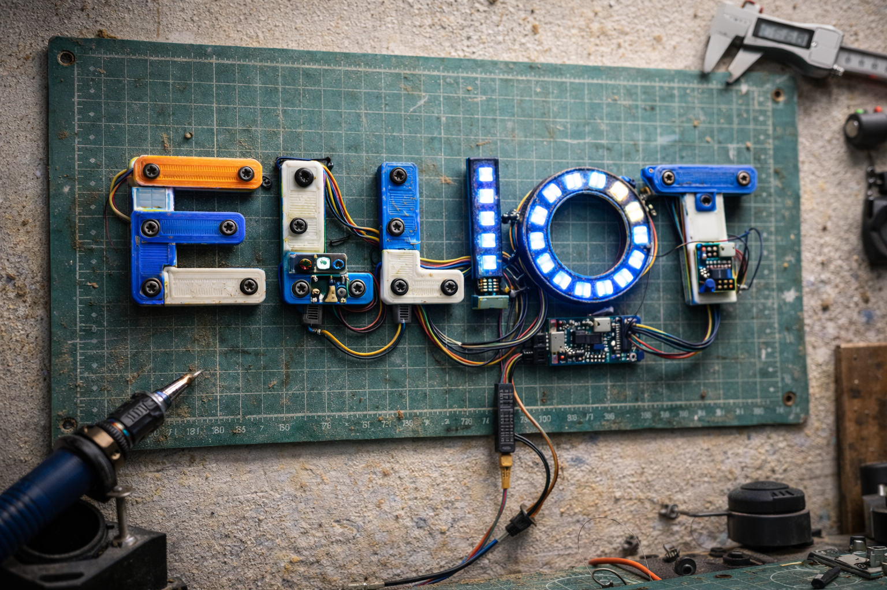

<p align="center">
  
</p>
# 🔧 ELLIOT
### Engine for Local Logic, Inference, Operations & Testing

> *"I can build anything. I just can't program it."*

**ELLIOT** is an open-source AI collaborator designed for makers, hobbyists, and DIYers who can design, wire, and build physical things — but hit a wall when a project needs code, firmware, or data logic behind it.

ELLIOT ships ready to help you add electronics to your 3D printed builds — LEDs, Arduino controllers, wiring, code — all from plain English descriptions. No programming background required. As your confidence grows, so does ELLIOT. He can help you build data loggers, dashboards, or any Python project you can dream up.

**Start with LEDs. Build anything.**

This is **not** another developer tool. This is a tool for the person who has a Bambu Labs printer, a box of Arduinos, a pile of WS2812 LEDs, and a project idea they can't finish because the software side is a black box.

---

## 🧩 The Problem

The maker community is massive. Millions of people use Fusion360, design PCBs, wire circuits, and 3D print enclosures. But the moment a project needs:

- An Arduino sketch to control LEDs
- A Python script to log sensor data
- A wiring diagram for a custom controller
- A data pipeline with a visual dashboard

...they're on their own. They copy a forum post from 2019, it doesn't work, they don't know why, and the project stalls.

Existing tools don't solve this:

- **GitHub Copilot / Cursor** — built for developers who can already read code
- **ChatGPT / Claude** — great at writing code, but can't run it, validate it, or tell you if the API endpoint you're hitting is returning garbage
- **OpenClaw / AutoGPT** — powerful but complex, terminal-heavy, breaks constantly, requires significant technical overhead to maintain. OpenClaw in particular was promising but required constant gateway restarts, terminal access, and enough technical knowledge to maintain the system itself — defeating the purpose for the people who need it most

**The gap:** An agent that speaks *project*, not *code*. One that can take a plain English description of a physical build, figure out what's needed, write everything, validate that it actually works, and explain the process in human terms.

---

## 💡 Meet ELLIOT

ELLIOT is a locally-run AI collaborator with a clean, simple web UI. You describe what you want to build. ELLIOT figures out the rest.

### Example interaction:

> *"Here's my STL file. I want to add LED accent lights inside. Use WS2812 LEDs and an Arduino Nano. I need to know how many LEDs fit, where they should go, how to wire it, and code to control them individually."*

ELLIOT responds with:
- LED count and placement map based on the STL geometry
- Power supply sizing based on LED count and draw
- Numbered wiring diagram
- Arduino sketch with each LED addressable by number
- Plain English explanation of every decision
- Validation that the code compiles and the logic is sound

No terminal commands. No dependency hell. No knowing what libraries to install. Just a working answer.

---

## 🎯 What ELLIOT Does

### Ships ready to use — 3D Printing + Electronics
This is ELLIOT's home turf. Out of the box, day one:
- Analyze STL files for LED placement, mounting points, cable routing
- Generate wiring diagrams for Arduino-controlled lighting inside printed enclosures
- Write and validate Arduino sketches
- Size power supplies based on component specs
- Explain every decision in plain English so you understand what you built

### Grows with you — Python Projects
Once you trust ELLIOT on your hardware projects, he can help with anything Python:
- Write and validate scripts for sensors, data logging, LED control
- Iterate based on plain English feedback ("the third LED is too bright")
- Validate that scripts return real, sane data — not just that they run without errors

### Expands further — Data & Dashboards
- Build local data loggers for any API or sensor feed
- Generate visual dashboards to monitor and interpret that data
- Validate data pipelines end-to-end before declaring success

---

## 🏗️ What Makes ELLIOT Different

| Feature | ELLIOT | ChatGPT | Cursor | OpenClaw |
|---|---|---|---|---|
| Speaks plain English project descriptions | ✅ | ✅ | ❌ | ❌ |
| Runs and validates code it writes | ✅ | ❌ | ✅ | ✅ |
| No terminal knowledge required | ✅ | ✅ | ❌ | ❌ |
| Understands hardware specs & constraints | ✅ | Partial | ❌ | ❌ |
| Stable, simple local setup | ✅ | N/A | ✅ | ❌ |
| Explains decisions in plain language | ✅ | ✅ | ❌ | ❌ |
| Validates data, not just syntax | ✅ | ❌ | ❌ | Partial |
| Built for makers, not developers | ✅ | ❌ | ❌ | ❌ |

---

## 🔬 How ELLIOT Works (Proposed Architecture)

```
You (plain English + files)
        ↓
  ELLIOT UI  (simple web interface, no terminal ever)
        ↓
  Agent Core  (Claude / GPT-4 via API)
        ↓
  ┌─────────────────────────────────┐
  │  Skill Modules                  │
  │  - STL Analyzer                 │
  │  - Wiring Diagram Generator     │
  │  - Arduino / MicroPython Writer │
  │  - Python Script Writer         │
  │  - API Validator                │
  │  - Dashboard Builder            │
  └─────────────────────────────────┘
        ↓
  Sandbox Runner  (runs code, captures output, validates results)
        ↓
  Results back in plain English + visuals
```

The key innovation is the **Sandbox Runner + Validator** — ELLIOT doesn't declare success until he has actually run the code and confirmed the output looks like what it should. Not just "it compiled" but "it hit the right endpoint and got real data back."

---

## 🛠️ Tech Stack (Proposed)

- **Backend:** Python
- **LLM:** Claude API or OpenAI API (user provides key)
- **UI:** Streamlit (simple, local, no web server knowledge needed)
- **Code execution:** Sandboxed Python subprocess with output capture
- **Arduino compilation:** Arduino CLI
- **Diagram generation:** KiCad netlist or SVG output
- **STL analysis:** numpy-stl or trimesh
- **Storage:** SQLite (local, zero config)

---

## 🚀 Roadmap

### Phase 1 — MVP
- [ ] Simple Streamlit UI with chat interface
- [ ] Claude/GPT-4 integration
- [ ] Python script writer + sandbox runner with output validation
- [ ] Basic LED/Arduino project template

### Phase 2 — Maker Core *(ELLIOT's home turf)*
- [ ] STL file analysis for LED placement
- [ ] Wiring diagram generation
- [ ] Arduino CLI integration for sketch compilation
- [ ] Hardware spec library (common LEDs, Arduinos, power supplies)

### Phase 3 — Data & Dashboards
- [ ] API data logger builder with validation
- [ ] Streamlit dashboard generator
- [ ] Data sanity checking (is this real data or garbage?)

---

## 🤝 Looking for Contributors

ELLIOT was conceived by a maker, not a developer. The vision is clear. The implementation needs people who love building tools that other people actually use.

**Specifically looking for:**
- A Python developer who has also built physical things and felt this pain
- Someone comfortable with LLM API integration
- Someone who values simplicity over cleverness — ELLIOT should never require the user to touch a terminal

If you're a developer who has ever handed a non-coder a script and watched them struggle to run it, you understand exactly why ELLIOT needs to exist.

**To get involved:** Open an issue, start a discussion, or reach out directly.

---

## 🧑‍🔧 Who ELLIOT Is For

- You have a 3D printer and want your prints to actually do things
- You buy Arduino kits and get halfway through before the code stops you
- You have a project idea that crosses hardware and software and you can build the hardware side
- You're not a programmer but you're not afraid of technology
- You've tried AI coding tools and still felt lost because you couldn't tell if what it built actually worked

**ELLIOT is built for you.**

---

## 📄 License

MIT — free to use, free to build on, free to fork.

---

*Started by a maker who got tired of wrestling with tools that assume you already know how to code.*
